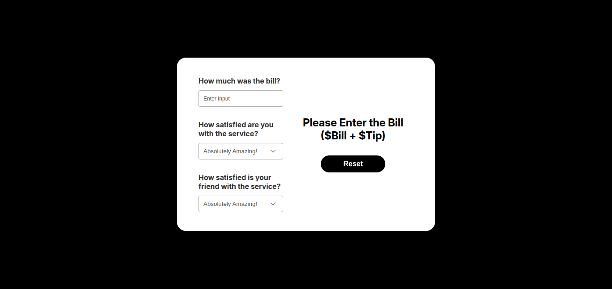

# Tip Calculator

Tip Calculator is a simply application that calculates tip based on your bill, it has a beautiful UI. It is the 1st project that is designed on Figma and then coded it 😊. It is a simple React Practice Project

Check out its
[FIgma Design](https://www.figma.com/design/JIBNMlgb1Y9Lt8GPyNtldZ/Tip-Calculator?node-id=0-1&t=wS2u2FTz4I5ZDhR4-1)
